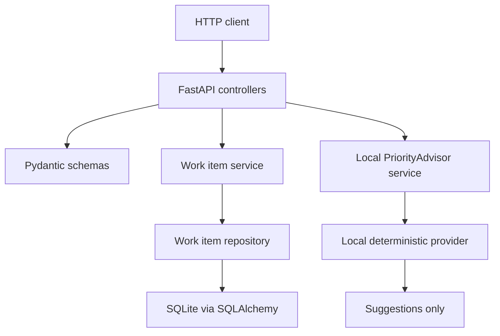

# micro-api-work-items

micro-api-work-items is a small academic REST API for managing generic work items with FastAPI, SQLite, automated tests, and local deterministic PriorityAdvisor rules.

A work item is a generic task-like record that can represent a task, bug, improvement, research item, operation item, or incident.

## Table Of Contents

- [Objective](#objective)
- [Academic Context](#academic-context)
- [Quick Start](#quick-start)
- [Setup Details](#setup-details)
- [Project Structure](#project-structure)
- [Architecture Overview](#architecture-overview)
- [Endpoints](#endpoints)
- [API Example Flow](#api-example-flow)
- [Tests](#tests)
- [Documentation Map](#documentation-map)
- [Troubleshooting](#troubleshooting)
- [Limitations](#limitations)
- [How Generative AI Was Used](#how-generative-ai-was-used)
- [Packaging And Submission Notes](#packaging-and-submission-notes)
- [License](#license)

## Objective

The objective is to demonstrate a simple backend MVP with clear scope, local persistence, validation, tests, documentation, and a Conventional Commit history.

## Academic Context

This repository was created as an AI-assisted mini-project for the first practical activity of the postgraduate course "Software Engineering with Generative AI" at UFG/AKCIT.

The course reference problem is a "Micro-API de Tarefas". This project implements the same small API idea using the more generic term "work item", so the API can represent tasks, bugs, improvements, research items, operation items, and incidents without becoming domain-specific.

| Course operation (PT) | Meaning (EN) | This project |
| --- | --- | --- |
| Criar tarefa | Create a work item | `POST /work-items` |
| Listar tarefas | List work items | `GET /work-items` |
| Atualizar status/prioridade | Partially update status or priority | `PATCH /work-items/{id}` |
| Excluir tarefa | Delete a work item | `DELETE /work-items/{id}` |
| Sugerir prioridade/classificação | Suggest priority and classification | `POST /work-items/classify` |

The course PriorityAdvisor concept is represented by a local deterministic PriorityAdvisor service. Runtime integration with external AI providers is intentionally out of scope for this MVP.

## Stack

- Python 3.11+
- FastAPI
- Pydantic v2
- SQLAlchemy
- SQLite
- Uvicorn
- Pytest
- HTTPX through FastAPI testing utilities

## Quick Start

Use the Makefile path first when `make` is available:

```bash
make install
make test
make run
```

The API will be available at `http://127.0.0.1:8000`.

If `make` is not available in your shell, use the equivalent `python -m ...` commands in the setup details below.

## Setup Details

The app reads `DATABASE_URL` from the operating system environment. If it is not set, it defaults to `sqlite:///./data/work_items.db`.

`.env.example` is a reference file only. It is not loaded automatically, and the project does not use `python-dotenv`.

The application does not use a runtime external LLM provider. No `OPENAI_API_KEY`, model name, or LLM timeout configuration is required.

### Recommended For Windows Users With Anaconda: Anaconda Prompt

```bash
conda create -n micro-api-work-items python=3.11
conda activate micro-api-work-items
python -m pip install -r requirements.txt
python -m pytest -q
python -m uvicorn app.main:app --reload
```

### Alternative: Windows PowerShell With Full Anaconda Python Path

Python available on PATH means the terminal can run Python by typing `python`. If that does not work, use Anaconda Prompt or the full Python executable path.

```powershell
$PY="C:\Users\<your-user>\anaconda3\python.exe"
& $PY -m pip install -r requirements.txt
& $PY -m pytest -q
& $PY -m uvicorn app.main:app --reload
```

If you use a dedicated Conda environment, the full path may be:

```powershell
$PY="C:\Users\<your-user>\anaconda3\envs\micro-api-work-items\python.exe"
```

### Alternative: Standard Python Virtual Environment

```bash
python -m venv .venv
source .venv/bin/activate
python -m pip install -r requirements.txt
python -m pytest -q
python -m uvicorn app.main:app --reload
```

On Windows PowerShell with `python` available:

```powershell
python -m venv .venv
.\.venv\Scripts\Activate.ps1
python -m pip install -r requirements.txt
python -m pytest -q
python -m uvicorn app.main:app --reload
```

### Alternative: Linux/WSL

```bash
python3 -m venv .venv
source .venv/bin/activate
python -m pip install -r requirements.txt
python -m pytest -q
python -m uvicorn app.main:app --reload
```

## Project Structure

```text
.
|-- app/
|   |-- controllers/       # FastAPI route handlers
|   |-- db/                # Database engine and session setup
|   |-- models/            # SQLAlchemy persistence models
|   |-- providers/         # Local deterministic PriorityAdvisor provider
|   |-- repositories/      # Persistence access functions
|   |-- schemas/           # Pydantic request and response schemas
|   `-- services/          # Work item CRUD and PriorityAdvisor logic
|-- data/                  # Local SQLite directory; database files are ignored
|-- docs/                  # Architecture, scope, decisions, prompts, demo, release notes
|-- tests/                 # API, service, repository, and PriorityAdvisor tests
|-- .env.example           # Reference-only environment variable example
|-- Makefile               # install, run, and test commands
|-- README.md
`-- requirements.txt
```

Course architecture terminology maps to this FastAPI project as follows:

- Controller = `app/controllers`
- Model = `app/schemas` for API contracts and `app/models/work_item_model.py` for persistence
- Service = `app/services`
- Repository = `app/repositories`
- Database/session = `app/db/database.py`

## Architecture Overview



The classification path is side-effect free: `POST /work-items/classify` uses the local PriorityAdvisor service to return suggestions and does not read or write persisted work items. Detailed diagrams are available in [docs/architecture.md](docs/architecture.md).

## Endpoints

| Method | Route | Description | Success Status | Notes |
| --- | --- | --- | --- | --- |
| `GET` | `/health` | Health check | `200` | Confirms service availability. |
| `POST` | `/work-items` | Create a work item | `201` | Persists data in SQLite. |
| `GET` | `/work-items` | List work items | `200` | Returns persisted work items. |
| `GET` | `/work-items/{id}` | Get one work item | `200` | Missing items return `404`. |
| `PATCH` | `/work-items/{id}` | Partially update a work item | `200` | `PUT` is intentionally not included. |
| `DELETE` | `/work-items/{id}` | Delete a work item | `204` | Missing items return `404`. |
| `POST` | `/work-items/classify` | Suggest type, priority, and tags | `200` | Does not persist data. |

## API Example Flow

The `curl` examples below are intended for Bash, Git Bash, macOS/Linux terminals, WSL, or real `curl.exe`. See [docs/api_examples.md](docs/api_examples.md) for detailed Bash and Windows PowerShell examples.

```bash
curl http://127.0.0.1:8000/health
```

```bash
curl -X POST http://127.0.0.1:8000/work-items \
  -H "Content-Type: application/json" \
  -d '{"title":"Review API docs","priority":"medium","type":"task","tags":["docs"]}'
```

```bash
curl http://127.0.0.1:8000/work-items
```

```bash
curl -X POST http://127.0.0.1:8000/work-items/classify \
  -H "Content-Type: application/json" \
  -d '{"title":"Critical incident with service outage","description":"The service is unavailable.","tags":["support"]}'
```

## Tests

Current verification result: `40 passed`.

```bash
make test
```

Equivalent command:

```bash
python -m pytest -q
```

The test suite covers:

- health endpoint;
- API CRUD routes;
- `404` responses for missing work items;
- `422` validation errors;
- tags and metadata persistence;
- `updated_at` behavior;
- service-level CRUD behavior;
- repository-level persistence behavior;
- PriorityAdvisor service behavior;
- local provider behavior;
- deterministic PriorityAdvisor output;
- classification non-persistence;
- isolated SQLite test database.

## Documentation Map

- [docs/architecture.md](docs/architecture.md): layered architecture, Mermaid diagrams, and course terminology mapping.
- [docs/decisions.md](docs/decisions.md): technical decisions and deferred scope.
- [docs/mvp_scope.md](docs/mvp_scope.md): MVP scope and acceptance checklist.
- [docs/backlog.md](docs/backlog.md): release-oriented backlog.
- [docs/api_examples.md](docs/api_examples.md): detailed curl and PowerShell API examples.
- [docs/local_llm_setup.md](docs/local_llm_setup.md): optional future local LLM setup guidance.
- [docs/external_provider_plan.md](docs/external_provider_plan.md): optional future external provider planning.
- [docs/prompts.md](docs/prompts.md): sanitized prompt traceability.
- [docs/release_checklist.md](docs/release_checklist.md): final submission checklist.

## Reset Local SQLite State

The default local database file is `data/work_items.db`. Stop the API server before deleting it.

In Bash, Git Bash, macOS/Linux terminals, or WSL:

```bash
rm -f data/work_items.db
```

In Windows PowerShell:

```powershell
Remove-Item -LiteralPath .\data\work_items.db -ErrorAction SilentlyContinue
```

The next application startup recreates the SQLite schema automatically.

## Troubleshooting

- If `make` is unavailable, use the `python -m ...` commands shown in setup details.
- If `python` is not recognized in PowerShell, use Anaconda Prompt or the full Anaconda Python executable path.
- If `uvicorn` is not recognized, run it as a module with `python -m uvicorn app.main:app --reload`.
- If `curl` behaves differently in PowerShell, use the `Invoke-RestMethod` examples in [docs/api_examples.md](docs/api_examples.md).
- If the API returns database-related errors after manual file changes, stop the server, remove `data/work_items.db`, and start the server again.
- `.env.example` is documentation only; environment variables must be set in the operating system if you want to override defaults.
- No runtime external LLM provider is used, so no AI provider credentials are needed.

## Limitations

- Local SQLite persistence only.
- Hard delete only.
- No authentication or authorization.
- No pagination or advanced filtering.
- No frontend.
- No Docker.
- No CI/CD.
- Local keyword-based classification only.
- No external LLM runtime, external AI providers, embeddings, RAG, agents, queues, streaming, or external integrations.

## Next Steps

- Add pagination and simple filters for list endpoints.
- Add Alembic migrations if schema evolution becomes necessary.
- Add richer validation rules for tags and metadata.
- Add deployment documentation for a non-local environment.

Future versions may expose the API as a reusable backend service for external clients, automation scripts, or agent-based tools through its HTTP/OpenAPI interface.

## How Generative AI Was Used

Generative AI supported scope planning, architecture discussion, implementation scaffolding, test design, documentation drafting, review, and refinement.

Human review was decisive for final scope decisions, preserving a local deterministic PriorityAdvisor instead of adding runtime LLM dependencies, validating tests, reviewing documentation, and rejecting over-scoped ideas.

Risk mitigation included avoiding credentials, avoiding paid runtime AI providers, avoiding external data sharing, keeping runtime behavior local and deterministic, and requiring tests and review before acceptance.

See [docs/prompts.md](docs/prompts.md) for generic CO-STAR prompt examples used for academic reproducibility.

## Packaging And Submission Notes

- Prefer submitting the GitHub repository so ignored local files remain excluded.
- If a ZIP is required, create it from tracked files with:

```bash
git archive --format=zip --output micro-api-work-items.zip HEAD
```

- Do not zip the whole working directory manually because it may include `.git`, `.venv`, `__pycache__`, `.pytest_cache`, or local database files.

## License

This project is licensed under the [MIT License](LICENSE).
