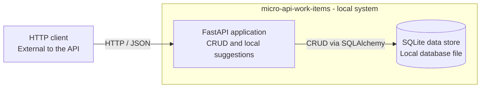
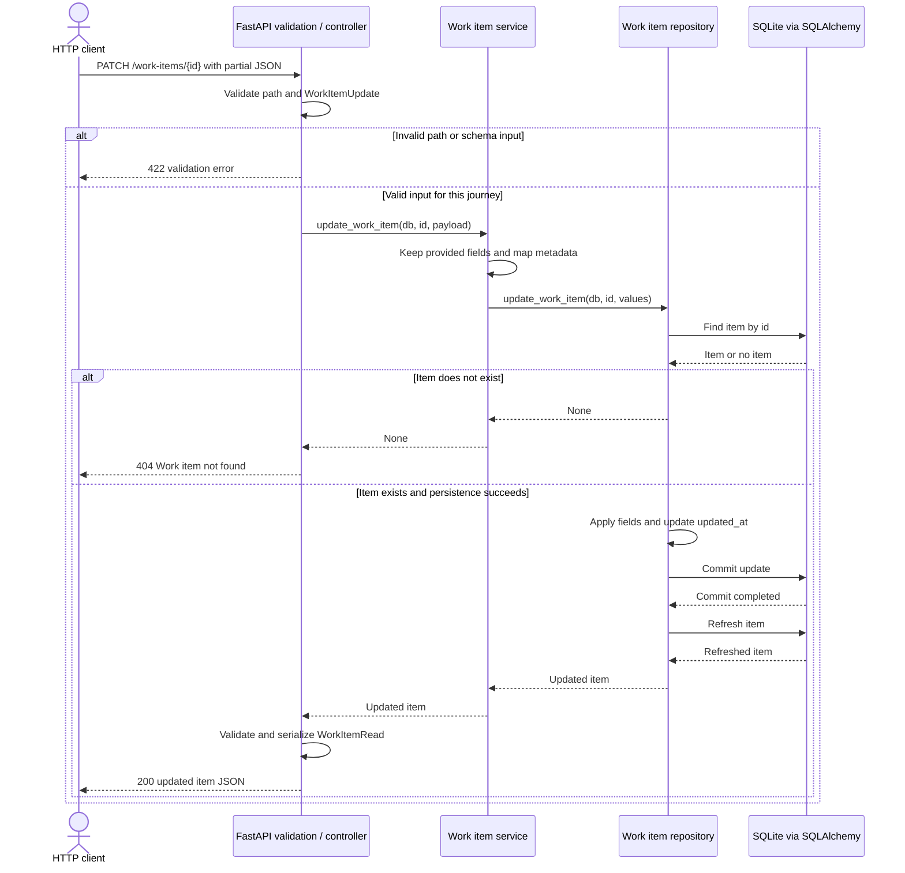
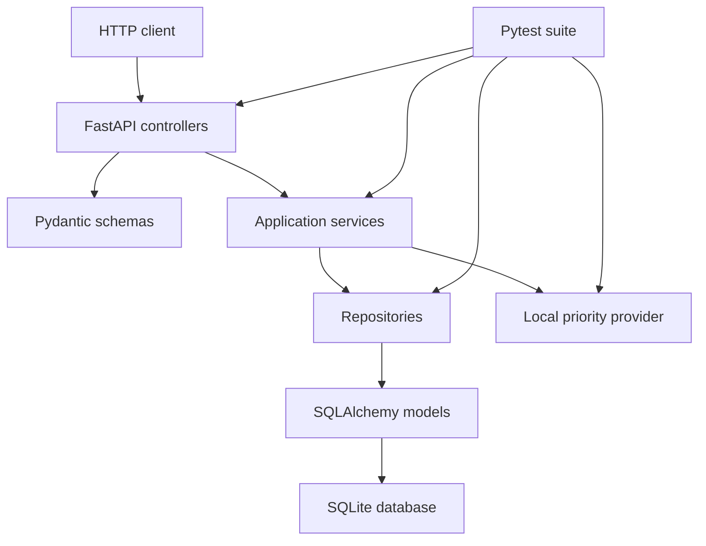
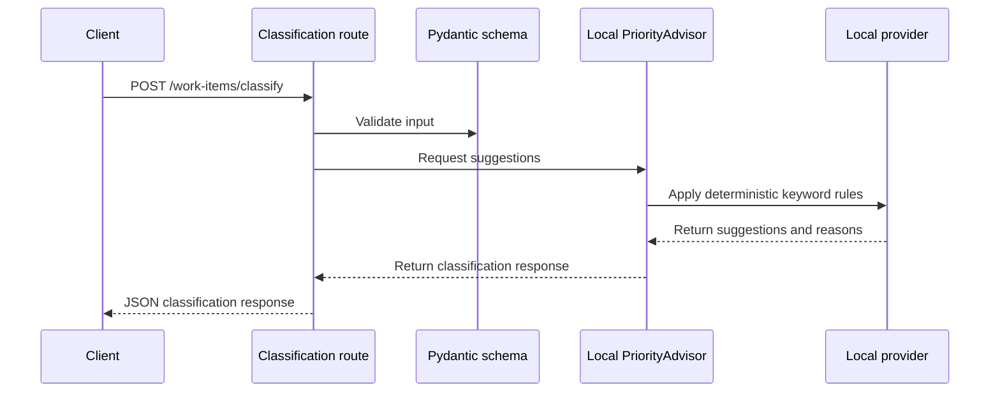

# Architecture

micro-api-work-items is a small FastAPI backend organized around a simple layered architecture.

## Documentation Discovery: Diagrams as Code

This activity documents the existing API; it does not propose a new runtime architecture. The source reference is commit `22f2ed4072e4c9484084a76bd5aeb84b07077e73`.

### System description and scope

The API records and tracks generic work items, supporting project organization through local CRUD operations and deterministic classification suggestions. Its implementation uses Python, FastAPI, Pydantic, SQLAlchemy and SQLite. Controllers handle HTTP, schemas define contracts, services coordinate application behavior, and repositories own persistence operations. These modules run within the same application.

The structural view below is inspired by C4 containers. It shows the HTTP client outside the system, the FastAPI application and the local SQLite data store. Here, container means an application or data store at this level of abstraction; it does not imply Docker. SQLite is an embedded local database, not a separate database server. Deployment details and internal modules belong to other views.

There is no external LLM in this runtime. PriorityAdvisor uses local rules, only returns suggestions and does not access saved work items (ADR-007/008). Generative AI assists documentation production; it is not a component to add to the application diagram. Simplicity, maintainability and the current public API contracts remain constraints.

### Structural view: containers

The API-to-store dependency belongs to CRUD and application initialization; it does not imply that classification reads or writes saved items.

### Behavioral view: partial update

The journey is `PATCH /work-items/{id}`, for example changing an existing item's status to `in_progress`. The diagram shows validation failure, a missing item and a successful update. FastAPI/Pydantic validation is part of the API, not a remote validation service. Session dependency lifecycle and application startup are omitted from this request-level view.

Only provided business fields are applied, and the repository updates `updated_at`. The successful branch assumes the database operation succeeds; it does not define recovery from a failed commit or promise special treatment of explicit null values. Metadata is mapped to the ORM attribute `metadata_json`.

### Diagram review and documentation changes

The AI-assisted review correctly identified one local application, persistence through SQLAlchemy/SQLite, layered CRUD and a separate deterministic classification path. No external LLM or additional service was required.

| Starting documentation | Adjustment in this activity | Why |
| --- | --- | --- |
| Existing layer views combine application modules and a database. | Added a separate container-level view, retaining the internal-layer view below. | Keep one abstraction level in each structural view. |
| The generic sequence groups POST/GET/PATCH/DELETE under `/work-items`. | Replaced it with the concrete `PATCH /work-items/{id}` journey. | Correct the path and make the operation reviewable. |
| One message combines request and response validation before application logic. | Separated input validation from response validation/serialization after the operation. | Represent their different positions in the interaction. |
| The CRUD sequence presents a generic successful return. | Added 422 and 404 alternatives, partial fields, commit and refresh. | Expose implemented branches and the persistence effect. |

These changes refine documentation of existing behavior. This documentation revision changes no application code, API contract or database schema. The initial diagram omissions were corrected during AI-assisted review; they were not missing application features. The documentation remains a review candidate until its branch is approved and merged.

### Implementation status and evidence

| Status | What it means here | Evidence |
| --- | --- | --- |
| Existing implementation | Partial PATCH preserves omitted fields and maps metadata; the repository looks up the item, updates provided fields and the timestamp, then commits and refreshes it. | [Service](../app/services/work_items.py), [repository](../app/repositories/work_item_repository.py), [ADR-004/005](decisions.md). |
| Existing implementation | The controller returns 404 for a missing item; request contracts use FastAPI/Pydantic validation. | [Controller](../app/controllers/work_item_controller.py), [schemas](../app/schemas/work_items.py). |
| Existing implementation | Classification uses deterministic local rules and does not access saved work items. | [PriorityAdvisor](../app/services/priority_advisor.py), [local provider](../app/providers/priority/local_provider.py), [ADR-007/008](decisions.md). |
| Documentation change in this revision | Added the container view, replaced the generic CRUD sequence and made validation, failures and persistence steps explicit. | Mermaid blocks and the review table above. |
| Open question, not implemented by this revision | Intended treatment of explicit null, concurrent updates and persistence failures. | Review questions below; no new guarantees are inferred. |

### Using this repository as context for a development agent

The repository is an evidence-based starting point for reconstructing or evolving the API. The diagrams describe boundaries and interactions; they must be used with contracts, decisions and executable examples. They are not a complete standalone specification.

Use this reading order for an implementation task:

1. [README](../README.md): scope, setup, endpoint inventory, example requests and limitations.
2. [Decisions](decisions.md): accepted constraints, including PATCH instead of PUT and classification without persistence or external LLMs.
3. [Pydantic schemas](../app/schemas/work_items.py) and [ORM model](../app/models/work_item_model.py): enums, defaults, required/nullable fields and the metadata mapping.
4. [Controller](../app/controllers/work_item_controller.py), [service](../app/services/work_items.py), [repository](../app/repositories/work_item_repository.py) and [local provider](../app/providers/priority/local_provider.py): actual call paths and side effects.
5. [API tests](../tests/test_work_items_api.py), [classifier tests](../tests/test_classifier.py) and [test fixtures](../tests/conftest.py): existing examples of expected behavior and their setup. Their presence is not proof of complete coverage.

Before implementing a change, state the requested behavior, affected contracts and acceptance examples. Compare them with accepted decisions and identify conflicts. Missing requirements or inconsistent evidence should become questions; they must not silently become new endpoints, infrastructure, quality targets or business rules. Record proposed tests separately from executed results, and update documentation alongside an approved behavior change.

### Remaining questions and verification limits

- **Omitted fields versus explicit null:** omitted PATCH fields are preserved. The update schema accepts None for fields whose database columns are not nullable. Clarify intended null semantics and verify the resulting API behavior before changing the contract or treating null as a supported clearing operation.
- **Concurrent updates:** no explicit conflict/version policy is documented. Define the expected behavior if this becomes a requirement rather than inventing optimistic locking or last-write guarantees.
- **Persistence failures:** the successful sequence assumes commit/refresh succeed. Recovery behavior, error responses and retry policy for database failures require separate analysis and tests.
- **Verification coverage:** existing API tests cover partial update, preserved fields and PATCH 404. The 422 branch follows the input contract and FastAPI validation behavior; the existing invalid-enum API example uses POST. A PATCH-specific invalid-input test and persistence-failure tests remain verification work.
- **Expanded operating scope:** production, multiple users, authentication, ownership and measurable quality requirements need separate requirements and decisions. They are outside the current local release (ADR-001/002).

The two discovery diagrams passed local Mermaid 11.12.0 syntax/render checks. The application test suite was not rerun for this documentation-only revision. Rendering checks syntax and presentation, not implementation correctness; a development agent must still execute the checks relevant to an approved implementation change.

## Layers

- Controllers receive HTTP requests and return response schemas.
- Pydantic schemas validate request and response data.
- Services hold application logic for persisted work items and local PriorityAdvisor suggestions.
- Providers contain the local deterministic PriorityAdvisor rule implementation.
- Repositories isolate persistence operations.
- SQLAlchemy models define local SQLite persistence.
- Tests validate API behavior and deterministic rules.

## Course Terminology Mapping

Some course examples describe the architecture as Controller -> Service -> Repository -> Database. This project keeps an idiomatic FastAPI structure while preserving the same responsibilities:

- Controller in the course = `app/controllers` in this project.
- Model in the course = `app/schemas` for API contracts and `app/models/work_item_model.py` for SQLAlchemy persistence models.
- Service in the course = `app/services` in this project.
- Repository in the course = `app/repositories` in this project.
- Database/session setup = `app/db/database.py`.

## Request Flow

The [partial-update sequence](#behavioral-view-partial-update) above replaces the previous generic CRUD sequence. It covers one concrete journey with validation failure, a missing item and successful persistence.

### Classification flow

The classification endpoint follows a separate PriorityAdvisor flow: it validates input, applies local deterministic rules, and returns suggestions without reading or writing saved work items.

## Persistence

The MVP uses SQLite through SQLAlchemy. The application reads `DATABASE_URL` from the operating system environment and defaults to `sqlite:///./data/work_items.db`.

The project does not use `python-dotenv`; `.env.example` is only a reference file.

## API Routes

- `GET /health`
- `POST /work-items`
- `GET /work-items`
- `GET /work-items/{id}`
- `PATCH /work-items/{id}`
- `DELETE /work-items/{id}`
- `POST /work-items/classify`
