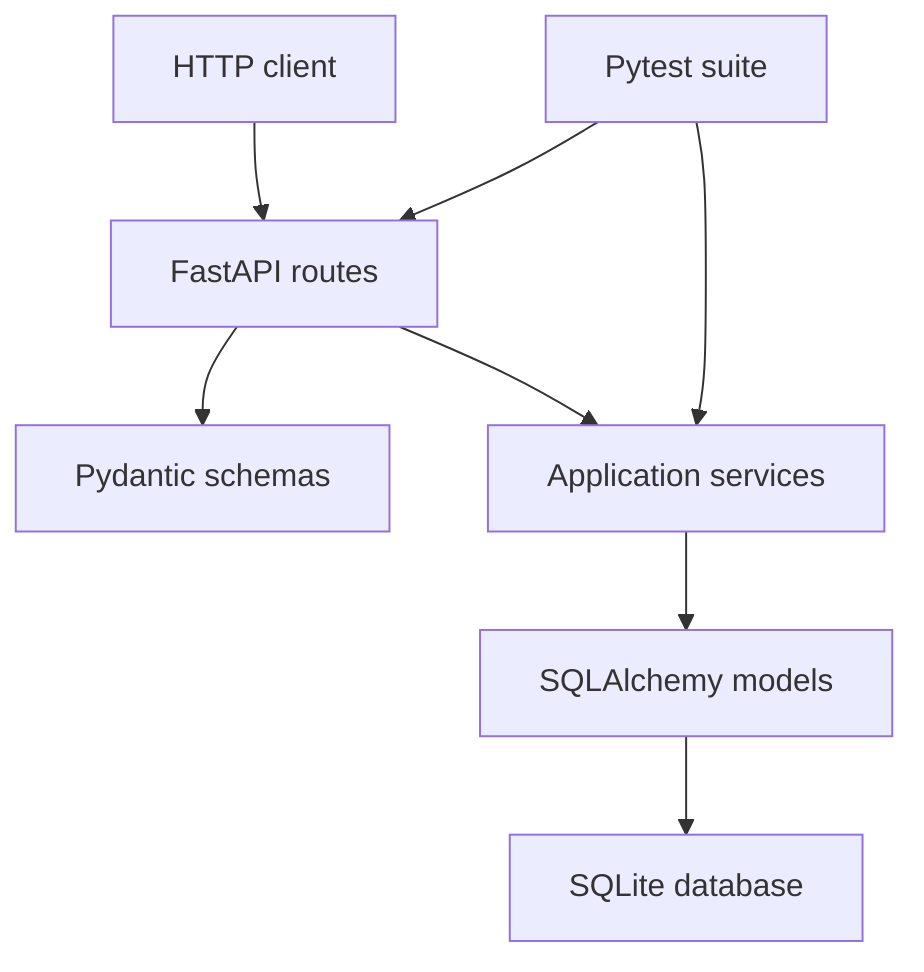
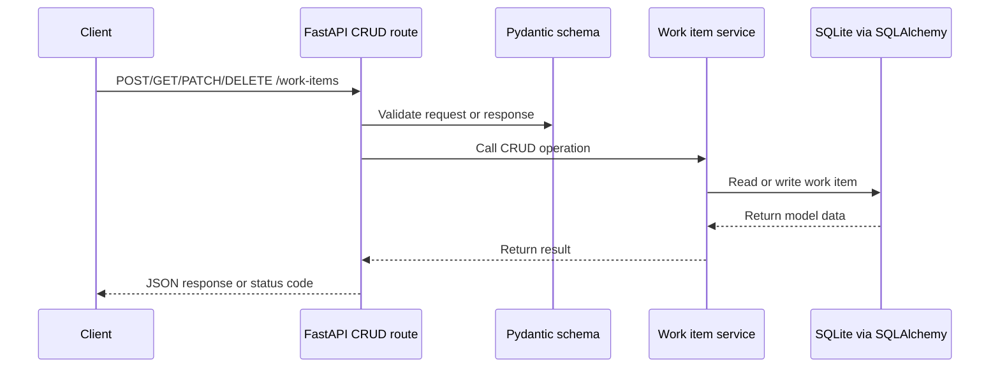
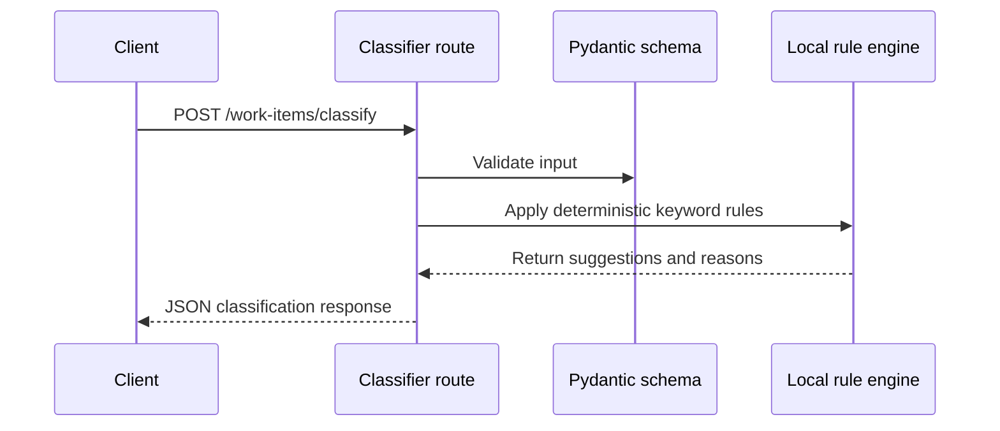

# Architecture

micro-api-work-items is a small FastAPI backend organized around a simple layered architecture.

## Layers

- API routes receive HTTP requests and return response schemas.
- Pydantic schemas validate request and response data.
- Services hold application logic for persisted work items and local classification.
- SQLAlchemy models define local SQLite persistence.
- Tests validate API behavior and deterministic rules.

## Request Flow

1. A client calls a FastAPI endpoint.
2. The route validates input using Pydantic schemas.
3. CRUD routes use the work item service and a SQLAlchemy session.
4. The service reads or writes SQLite data through SQLAlchemy models.
5. The route returns a Pydantic response model.

The classifier endpoint follows a separate flow: it validates input, applies local deterministic rules, and returns suggestions without writing to the database.

## Persistence

The MVP uses SQLite through SQLAlchemy. The application reads `DATABASE_URL` from the operating system environment and defaults to `sqlite:///./work_items.db`.

The project does not use `python-dotenv`; `.env.example` is only a reference file.

## API Routes

- `GET /health`
- `POST /work-items`
- `GET /work-items`
- `GET /work-items/{id}`
- `PATCH /work-items/{id}`
- `DELETE /work-items/{id}`
- `POST /work-items/classify`
