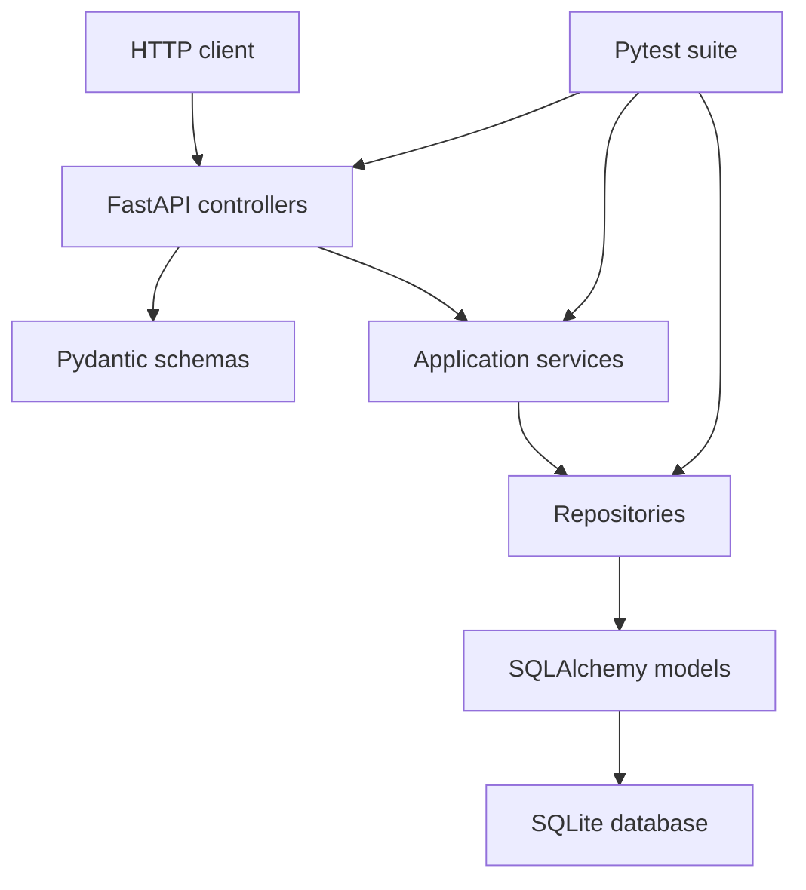
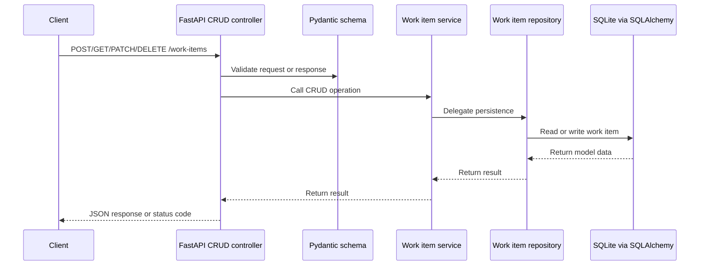
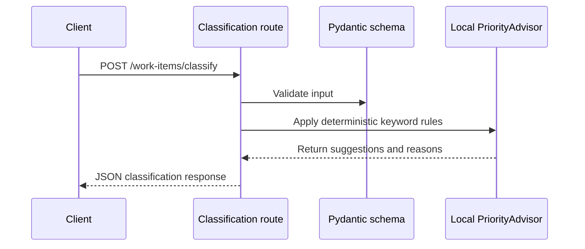

# Architecture

micro-api-work-items is a small FastAPI backend organized around a simple layered architecture.

## Layers

- Controllers receive HTTP requests and return response schemas.
- Pydantic schemas validate request and response data.
- Services hold application logic for persisted work items and local PriorityAdvisor suggestions.
- Repositories isolate persistence operations.
- SQLAlchemy models define local SQLite persistence.
- Tests validate API behavior and deterministic rules.

## Course Terminology Mapping

Some course examples describe the architecture as Controller -> Service -> Repository -> Database. This project keeps an idiomatic FastAPI structure while preserving the same responsibilities:

- Controller in the course = `app/controllers` in this project.
- Model in the course = `app/schemas` for API contracts and `app/models/work_item_model.py` for SQLAlchemy persistence models.
- Service in the course = `app/services` in this project.
- Repository in the course = `app/repositories` in this project.
- Database/session setup = `app/db/database.py`.

## Request Flow

1. A client calls a FastAPI endpoint.
2. The route validates input using Pydantic schemas.
3. CRUD controllers use the work item service and a SQLAlchemy session.
4. The service delegates persistence operations to the repository.
5. The repository reads or writes SQLite data through SQLAlchemy models.
6. The controller returns a Pydantic response model.

The classification endpoint follows a separate PriorityAdvisor flow: it validates input, applies local deterministic rules, and returns suggestions without writing to the database.

## Persistence

The MVP uses SQLite through SQLAlchemy. The application reads `DATABASE_URL` from the operating system environment and defaults to `sqlite:///./data/work_items.db`.

The project does not use `python-dotenv`; `.env.example` is only a reference file.

## API Routes

- `GET /health`
- `POST /work-items`
- `GET /work-items`
- `GET /work-items/{id}`
- `PATCH /work-items/{id}`
- `DELETE /work-items/{id}`
- `POST /work-items/classify`
